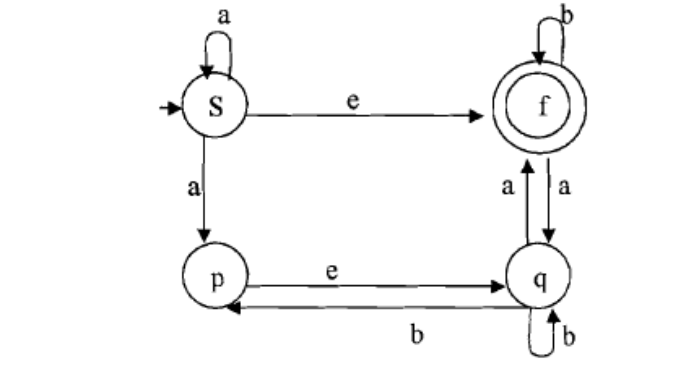
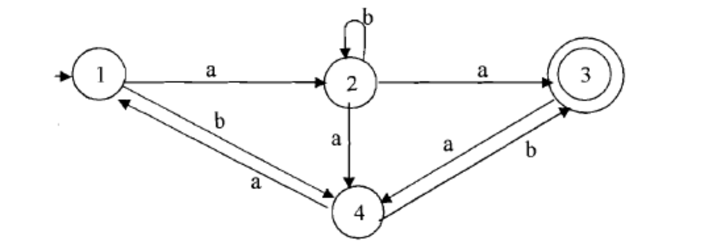
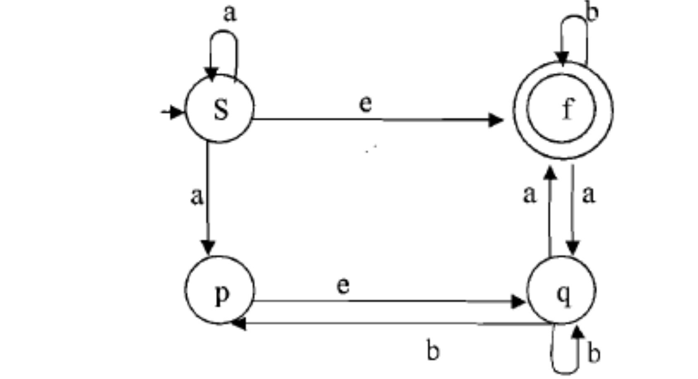

# Homework 7 (Due March 25, 2019)

> **Note:** You can either hand in the solution on due date or e-mail to TA
> or CSC 6500. His email address is tuan.minh.nguyen@wayne.edu

## Problem 1 (20pts)

Convert the following NFA into DFA that accepts the same language. Here `e` is empty string.



## Problem 2 (20pts)

Convert the following NFA into regular expression.

  

## Problem 3 (20pts)

Convert the following grammar into a PDA which will accept the language defined by this grammar.


```
E -> I | E*E | E+E | (E)
I -> a | b | Ia | Ib | I0 | I1

Where...
    Alphabet     = {a,b,0,1,(,)}
    Non-terminal = {E,I}
    E            = start symbol
```

## Problem 4 (20pts)

Convert the following NFA to regular grammar (`e` is empty string).



## Problem 5 (20pts)

Design a Turing Machine which will accept the language

```
{a^nb^n}
```
